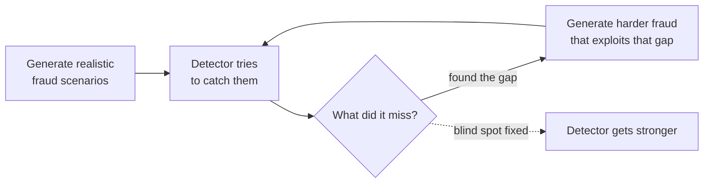

# Chakravyuh

A system that generates fake (but realistic) payment fraud, tries to catch it with a
machine learning model, and then automatically uses whatever the model *missed* to
generate harder fraud - on repeat. Built for the Mastercard Innovation Challenge 2026.

**[Live demo →](https://chakravyuh-web.chatbot-sockscarving.workers.dev/)**

---

## The problem, in plain terms

Most fraud demos work like this: make up some fraud, train a model on it, report a
99% accuracy number, done. That's not actually hard - a model can look great at
catching fraud it was specifically trained to catch.

The harder, more honest question is: **what fraud does the model *not* see coming?**
That's what this project is actually about. It's a loop, not a one-shot demo:



Every round, the fraud gets smarter, and so does the detector defending against it.
The [closed-loop write-up](docs/closed-loop.md) has real before/after numbers from
running this loop twice: recall at a strict 0.1% false-positive rate went from
99.42% to 100.00%.

## What's actually inside

Three things, and each one lives in its own folder:

| Folder | What it does |
|---|---|
| [`src/`](src) | Builds a fake but statistically realistic world - regular people, merchants, and normal payments - then injects fraud into it. |
| [`stage5/`](stage5) | The detector: turns transactions into features, trains a model on them, and figures out what it's bad at. |
| [`web/`](web) | The demo app - score a transaction live, see *why* the model flagged it, watch the fraud/detector loop play out. |

If you only read one thing before digging into code, read
[`docs/master-project-brief.md`](docs/master-project-brief.md) - it explains *why*
the project is shaped this way, not just what the code does. For the full
phase-by-phase story of how it was built - including what we tried, what we
rejected, and why - see [`PROPOSAL.md`](PROPOSAL.md).

## The 16 kinds of fraud it simulates

Real fraud doesn't look suspicious on paper - that's the whole problem. A [digital
arrest scam](https://en.wikipedia.org/wiki/Police_impersonation), for example, has
the real customer, on their real phone, entering their real PIN. Every signal a bank
normally checks looks completely normal. The only thing wrong is *why* they're
sending the money.

So instead of guessing at fraud patterns, this project worked backwards from each
payment method (cards, UPI, IMPS/NEFT/RTGS, wallets, BNPL) and asked: *at each step,
who is trusting whom, and how could that trust be broken?* That process produced 16
distinct attack types - a few examples:

- **`scam_induced_push`** - the victim is talked into sending money themselves (fake
  police call, romance scam, fake job offer).
- **`mule_network`** - stolen money bounces through a chain of accounts to obscure
  where it ends up.
- **`adversarial_evasion`** - fraud deliberately shaped to look like a normal
  transaction to the *current* model, i.e. it's designed to sneak past detection.

The full list, with the reasoning behind each one, is in
[`docs/attack-catalogue.md`](docs/attack-catalogue.md). The code for each lives in
[`src/attacks/generators.py`](src/attacks/generators.py).

## Try it yourself

You'll need Python 3.11+ and [`uv`](https://docs.astral.sh/uv/) (a fast Python
package manager).

```bash
uv sync                                   # install dependencies
make data SEED=42                         # generate a fake population + normal payments
make graph                                # build the counterparty graph over that population
make attack ATTACK=scam_induced_push INTENSITY=medium   # layer one type of fraud on top
make test                                 # run the test suite
make lint                                 # check code style
```

Every command with `SEED=42` produces byte-for-byte identical output every time -
that's deliberate, so results are reproducible, not lucky.

Training the actual fraud-detection model takes longer (several minutes) and isn't
wired into `make` yet:

```bash
uv run python -m stage5.training.generate_training_data
uv run python -m stage5.training.train_fraud_model
uv run python -m stage5.training.train_attack_classifier
```

To run the web demo locally, see [`web/README.md`](web/README.md).

## Why XGBoost, not something fancier

Short version: it was tested head-to-head against a Random Forest baseline on the
same data split, won on the metric that matters most for fraud (recall at a very low
false-positive rate), and comes with fast, well-understood tools (SHAP) for
explaining *why* it flagged a transaction - which matters when a real analyst has to
act on the alert. The full comparison is in [`docs/model-choice.md`](docs/model-choice.md).

## A few honest caveats

- All data is synthetic. No real card numbers, no real people, nothing that ever
  touched a real payment system.
- The GenAI-written analyst notes in the demo are optional - off by default, and the
  app works fully without them. If you want to try it, put a `GOOGLE_GEMINI_API_KEY`
  in a local `.env` file (never commit it). Without a key, the app falls back to a
  plain template automatically.
- This was built solo/small-team against a hard deadline. Not every internal doc in
  this repo is polished - some are working notes from along the way, not
  documentation meant for a reader. If a doc under `docs/` contradicts this README,
  trust the code first.

## License

MIT - see [`LICENSE`](LICENSE).
